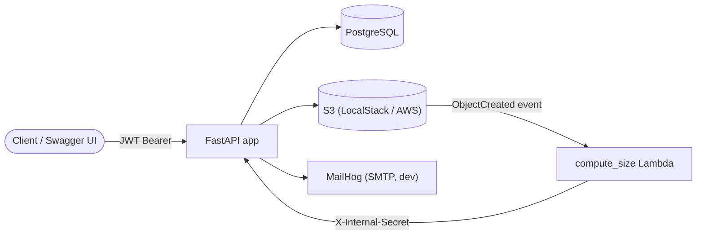

# Project Management Dashboard

FastAPI backend for a project management dashboard: JWT-authenticated projects
with owner/participant access control, S3-backed document storage, email
invites, and async background processing via Lambda.

## Tech Stack

| Layer | Tool | Why |
|---|---|---|
| Web framework | [FastAPI](https://fastapi.tiangolo.com/) + [Uvicorn](https://www.uvicorn.org/) | async-native, generates the `/docs` OpenAPI UI for free |
| Database / ORM | [PostgreSQL](https://www.postgresql.org/), [SQLAlchemy 2.0](https://www.sqlalchemy.org/) (async), [Alembic](https://alembic.sqlalchemy.org/) | the real data layer; `asyncpg` is the driver |
| No-ORM deliverable | plain [`asyncpg`](https://magicstack.github.io/asyncpg/) | `app/db/raw/` — hand-written SQL, per the course's "with/without ORM" requirement |
| Auth | [`python-jose`](https://github.com/mpdavis/python-jose) (JWT), [`passlib[bcrypt]`](https://passlib.readthedocs.io/) | token issuing/verification, password hashing |
| Config | [`pydantic-settings`](https://docs.pydantic.dev/latest/concepts/pydantic_settings/) | typed env-var settings (`app/core/config.py`) |
| Object storage | [`aioboto3`](https://github.com/terrycain/aioboto3) against [LocalStack](https://www.localstack.cloud/) (dev) or real S3 (prod) | async S3 client, same code path both environments |
| Email (dev) | [MailHog](https://github.com/mailhog/MailHog) over SMTP (stdlib `smtplib`) | invite links land in a local inbox instead of needing real SMTP/SES |
| Background compute | AWS Lambda (via LocalStack locally) | async project size recompute, triggered by S3 upload events |
| Containers | Docker, Docker Compose | one command brings up the whole stack: api, db, localstack, mailhog |
| Testing | `pytest`, `pytest-asyncio`, `pytest-cov`, `httpx` (`ASGITransport`) | unit tests (fakes) + integration tests (real Postgres/S3) — see [Testing](#testing) |
| Lint / format | [`ruff`](https://docs.astral.sh/ruff/) | one fast tool covering flake8 + isort + a formatter |
| Task runner | [`tox`](https://tox.wiki/) | `tox -e lint` / `tox -e test` run identically in CI and locally |
| Dependencies | [Poetry](https://python-poetry.org/) | `pyproject.toml` + committed `poetry.lock` for reproducible installs |
| CI/CD | GitHub Actions, GHCR | lint → test → build → (push on `main`) → deploy placeholder |

## Architecture



The API is the only thing clients talk to directly. The Lambda is invoked
asynchronously by S3 itself, not by the API — `compute_size` calls back into
a small internal endpoint (shared-secret, not JWT, since a Lambda has no
user). See [Async Background Processing](#async-background-processing-lambda)
for why that split exists.

## Getting Started

```powershell
docker compose up --build
```

Then visit:

- API health: http://localhost:8000/health
- OpenAPI docs: http://localhost:8000/docs — the interactive way to try every
  endpoint below; click **Authorize** after logging in via `/login`.
- MailHog inbox (invite emails): http://localhost:8025

Local development uses Postgres, LocalStack (S3 + Lambda), and MailHog
through Docker Compose — see `docker-compose.yml` and `.env.example` for the
full list of services and settings.

## API Summary

Every route below requires a `Bearer` JWT (`/auth`, `/login`, `/health` are
the only exceptions) — see the per-section write-ups further down for the
access-control rules, request/response shapes, and design reasoning behind
each group.

| Method | Path | Purpose |
|---|---|---|
| POST | `/auth` | Register |
| POST | `/login` | Log in, get a JWT |
| GET | `/me` | Current user |
| POST | `/projects` | Create a project (creator becomes owner) |
| GET | `/projects` | List accessible projects, with nested documents |
| GET | `/project/{id}/info` | Read one project |
| PUT | `/project/{id}/info` | Update name/description (owner or participant) |
| DELETE | `/project/{id}` | Delete a project and its documents (owner-only) |
| POST | `/project/{id}/documents` | Upload one or more documents |
| GET | `/project/{id}/documents` | List a project's documents |
| GET | `/document/{id}` | Download a document |
| PUT | `/document/{id}` | Replace a document's content |
| DELETE | `/document/{id}` | Delete a document |
| POST | `/project/{id}/invite` | Grant a user access by login (owner-only) |
| GET | `/project/{id}/share` | Email a signed, expiring join link (owner-only) |
| GET | `/join` | Redeem a share-link token |
| POST | `/internal/projects/{id}/recompute-size` | Lambda-only: re-derive the size counter (shared secret, not JWT) |
| GET | `/health` | Liveness + DB connectivity check |

## Data Model

Phase 2 uses a normalized relational design:

- `users` stores one row per account.
- `projects` stores project metadata and points to the owning user.
- `project_access` stores project membership and role, so a project can have
  many users without duplicating user or project data.
- `documents` stores document metadata and points to its parent project.

The deliberate denormalization is `projects.total_size_bytes`. The normalized
source of truth is still the `documents.size_bytes` rows, but keeping the total
on `projects` lets the API check project storage limits without running a
`SUM()` over documents on every project read. The tradeoff is that uploads,
deletes, and later the Lambda size recompute need to keep that counter correct.

The real application uses SQLAlchemy models and Alembic migrations. The
`app/db/raw/` folder contains a plain SQL schema plus asyncpg examples for the
course requirement to show the same database work without an ORM.

## Project Endpoints

Phase 4 adds JWT-protected project management endpoints:

- `POST /projects` creates a project and grants the creator the `owner` role.
- `GET /projects` lists projects the current user can access, including nested
  document metadata.
- `GET /project/{project_id}/info` returns one accessible project.
- `PUT /project/{project_id}/info` lets owners or participants edit name and
  description.
- `DELETE /project/{project_id}` is owner-only; it removes every stored object
  for the project before deleting the row (cascade clears the child rows).

## Document Endpoints

Phase 5 stores document content in S3 (LocalStack locally) and keeps only
metadata in Postgres:

- `POST /project/{project_id}/documents` uploads one or more files.
- `GET /project/{project_id}/documents` lists the project's document metadata.
- `GET /document/{document_id}` streams the file back with its original
  `Content-Type` and `Content-Disposition`.
- `PUT /document/{document_id}` replaces the stored file and its metadata.
- `DELETE /document/{document_id}` removes the object and the row.

Every document route authorizes against the document's *parent project*, so a
user with no `project_access` row gets a 404 rather than a leak that the
document exists.

### Storage rules

- Objects are keyed `projects/{project_id}/{document_id}/{filename}`, which
  keeps everything for one project under a single prefix.
- Uploads are validated by extension (`ALLOWED_DOCUMENT_EXTENSIONS`, default
  `.pdf,.docx`) and rejected with 400 when the type is not allowed.
- A single file over `MAX_DOCUMENT_SIZE_BYTES`, or an upload that would push
  `projects.total_size_bytes` past `MAX_PROJECT_SIZE_BYTES`, is rejected with
  413. The limit check reads the denormalized counter from Phase 2 instead of
  summing document rows, and uploads/replacements/deletes keep that counter in
  step. Phase 7 adds the asynchronous Lambda recompute.
- Uploads are transactional: if S3 or the database fails part-way, the rows are
  rolled back and any objects already written are removed.
- The bucket is created on startup if it does not exist, so a fresh LocalStack
  container works without manual setup.

## Sharing Endpoints

Phase 6 lets owners bring other users onto a project:

- `POST /project/{project_id}/invite?user=<login>` grants the named user the
  `participant` role. Owner-only; a participant gets 403 and a non-member 404.
- `GET /project/{project_id}/share?with=<email>` emails a signed, expiring join
  link and returns it in the response for local testing. Owner-only.
- `GET /join?token=...` adds the *authenticated* caller to the project the token
  names.

Both grants are idempotent: re-inviting somebody returns 200 with
`"created": false` rather than erroring, and it never demotes an existing owner
to participant.

### Invite links

The token is a JWT carrying `{project_id, purpose: "invite"}` and its own expiry
(`INVITE_TOKEN_EXPIRE_MINUTES`, default 24h), so the link is tamper-proof and
time-limited. It is signed with the same secret as the login token, so the
`purpose` claim is what keeps the two apart — an access token is rejected at
`/join`, and an invite token is rejected as an `Authorization` header.

The link is deliberately bearer-style: it names a project, not a user, so
whoever redeems it while signed in is the one who gets access. That matches the
"email a link" flow, where the recipient's account is unknown at send time.

`GET /join` returns 401 rather than redirecting an unauthenticated visitor to a
login page. This API is JSON-and-JWT with no HTML login form to redirect to, and
`POST /login` cannot serve a browser GET — a UI in front of this API is the
right place for the `next=` round trip.

### Email in development

`docker compose` runs **MailHog**. The API sends invites to it over SMTP, and
the messages are readable at http://localhost:8025. With `SMTP_HOST` unset the
API logs the link instead, so nothing depends on a mail server. A mail server
that is down or unreachable degrades to logging as well — a failed send never
fails the share request, and the response's `email_delivery` field reports which
path was taken.

## Async Background Processing (Lambda)

Phase 7 adds a Lambda triggered by S3 `ObjectCreated` events (prefix-filtered
to `projects/`) on the documents bucket — see
[`lambdas/compute_size/`](lambdas/compute_size) for the handler itself.

- **`compute_size`** re-sums `documents.size_bytes` for the uploaded object's
  project and calls back into
  `POST /internal/projects/{project_id}/recompute-size` (protected by an
  `X-Internal-Secret` header, not a JWT — the Lambda has no user and no
  database credentials) to correct `projects.total_size_bytes`. The API
  already keeps that counter right on the synchronous upload/replace/delete
  path; this is the asynchronous *repair* path for the Phase 2
  denormalization, recovering from any drift the synchronous path missed.

### Local deployment

LocalStack (`SERVICES: s3,lambda,logs` in `docker-compose.yml`) runs the
Lambda. `docker/localstack-init/ready.d/deploy_lambdas.py` is a LocalStack
["ready" init hook](https://docs.localstack.cloud/references/init-hooks/):
LocalStack executes every `.py` file under `/etc/localstack/init/ready.d`
with its own bundled Python once the S3/Lambda providers are up, so this
needs no separate build step or executable bit — it runs automatically on
`docker compose up`. It packages the Lambda's `.py` files, creates or updates
the function, grants S3 permission to invoke it, and wires the bucket
notification — zero manual `awslocal` commands needed.

One thing worth knowing if you poke at this yourself: **Lambda `print()`
output goes to CloudWatch Logs, not the container's own stdout.**
`docker compose logs localstack` won't show it. Use:

```
docker compose exec localstack awslocal logs filter-log-events \
  --log-group-name /aws/lambda/compute_size --query 'events[].message' --output text
```

### Checkpoint, reproduced

Upload a document, and `compute_size` fires and recomputes the total. To prove
it's genuinely the Lambda doing the work (not just the API's own synchronous
bookkeeping), corrupt `projects.total_size_bytes` directly in Postgres, then
upload another document — the API's synchronous path would leave the counter
at `corrupted_value + new_upload_size`, still wrong. Only the Lambda's async
recompute, which re-derives the total from `documents.size_bytes`, lands on
the true sum. This was run against a fresh, from-scratch `docker compose up`
and passed.

## Testing

Two tiers, matching different things that break:

- **`tests/*.py`** — fast, dependency-injected unit tests. Every DB/S3 call is
  a fake or a fixture, so there's nothing to start; `poetry run pytest` runs
  them in a couple of seconds. Good for exercising validation logic, access
  rules, and route wiring in isolation.
- **`tests/integration/*.py`** — the real FastAPI app driven end-to-end
  through `httpx.AsyncClient` + `ASGITransport`, against a real Postgres
  database and real LocalStack S3. These are what actually prove the
  register→login→create-project→upload→download→invite flows work together,
  not just in isolation.

Run everything:

```powershell
docker compose up -d db localstack   # only these two services are needed
poetry run tox -e test               # migrations checkpoint + pytest --cov
```

(`poetry run pytest` directly also works — `tox -e test` just wraps that same
command so CI and local dev can never drift apart; see [CI/CD](#cicd).)

If `db`/`localstack` aren't reachable on `localhost`, every integration test
is **skipped**, not failed — `poetry run pytest` still passes with just the
unit tests. This is a fixture check (`tests/integration/conftest.py`), not a
manual step: nothing needs to be configured to get that behavior.

### How the integration suite stays isolated

- **Database:** a dedicated `project_dashboard_test` database (created
  automatically if missing) gets Alembic migrations run against it once per
  session. Each test gets its own connection wrapped in an outer transaction;
  the app's own `session.commit()` calls become `SAVEPOINT`s nested inside it
  (SQLAlchemy's `join_transaction_mode="create_savepoint"`), and the whole
  thing rolls back at the end of the test. Nothing a test writes is ever
  visible to another test or left behind in the database. The engine itself
  is also created fresh per test rather than shared — pytest-asyncio gives
  each test its own event loop, and asyncpg connections are bound to the loop
  that opened them, so a shared engine would occasionally hand one test a
  connection created (and unusable) on a previous test's already-closed loop.
- **S3:** real calls to LocalStack, using the app's actual `aioboto3`-based
  `app/storage/s3_client.py` — not a mock. Objects this suite writes stay in
  the bucket (S3 has no transactions to roll back), but every test uses a
  fresh project/document id, so nothing collides.
- **Why LocalStack and not `moto`:** this app talks to S3 through `aioboto3`
  (`aiobotocore`), whose HTTP calls go over `aiohttp`. `moto`'s request
  interception patches botocore's own HTTP layer and doesn't reliably catch
  `aiohttp`-based traffic, so it silently fails to mock `aiobotocore` calls.
  Phase 8's own notes allow this alternative ("mock S3 with moto, or point at
  LocalStack in CI"), and this project already has a fully verified LocalStack
  setup from Phases 5/7 — reusing it here is more reliable than fighting that
  incompatibility, and Phase 9's CI spins up the same service containers.

### Coverage

```powershell
poetry run tox -e test
```

Currently **89%** on `app/`, comfortably inside the 70–80% goal. Two notes if
you check this yourself:

- The coverage config sets `concurrency = ["greenlet"]`. SQLAlchemy's async
  engine bridges to its sync core through a spawned greenlet for every
  awaited DB call; without this setting, `coverage.py` can't see into that
  greenlet and drastically *under*-counts every route that touches the
  database (as low as 55% instead of 90%+ for the same code).
- `app/db/raw/queries.py` (the Phase 2 "without ORM" deliverable) has its own
  small, self-contained integration tests
  (`tests/integration/test_raw_queries.py`) using a plain `asyncpg` connection
  — it doesn't power the real API, so it isn't exercised by anything else.

## CI/CD

`.github/workflows/ci.yml` runs on every push and pull request:

- **lint** — `tox -e lint` (`ruff check .` + `ruff format --check .`).
- **test** — `docker compose up -d --wait db localstack` (only those two; the
  suite talks to the app in-process, not over HTTP, so `api`/`mailhog` aren't
  needed), then `tox -e test` (`alembic upgrade head` against the real dev
  database as a standalone checkpoint, then `pytest --cov=app
  --cov-report=xml`). The coverage XML is uploaded as a workflow artifact.
  Both jobs cache Poetry's install directory, keyed on `poetry.lock`'s hash —
  meaning `poetry.lock` needs to be committed (it wasn't, from Phase 1 onward;
  fixed as part of this phase) for the cache and reproducible installs to
  actually work.
- **`tox.ini`** is what actually defines the lint/test commands (Phase 10):
  CI calls `poetry run tox -e lint` / `poetry run tox -e test`, and running
  the identical command locally can never drift from what CI checks, since
  there's only one place the commands are written down. `skip_install=true` +
  `allowlist_externals=poetry` makes tox a thin command runner here — Poetry
  already manages the real isolated environment, so tox isn't asked to
  duplicate that.
- **build** — needs lint + test to pass first. Builds the Dockerfile with
  `docker/build-push-action`, tagged with the git SHA (and `latest` on
  `main`). Pushes to GHCR only on `push` events (not `pull_request`, since
  forked PRs don't have registry write access and shouldn't publish images).
  `docker/metadata-action` lowercases the image name automatically — GHCR
  rejects uppercase, and `github.repository` preserves whatever case the
  GitHub org/repo actually has.
- **deploy** — gated to pushes on `main` only. No real target exists yet, so
  this is a placeholder step that prints the pushed image reference rather
  than pretending to deploy somewhere. Per the plan's own guidance ("don't
  over-engineer this part unless your course specifically grades cloud
  deployment"), wire it up to a real target (SSH + `docker compose pull && up
  -d`, a cloud run service, etc.) if and when you have one.

One gotcha the CI setup surfaced and fixed: the LocalStack Lambda init hook
(`docker/localstack-init/ready.d/deploy_lambdas.py`) used to wait up to 30s
for the `api` container to create the S3 bucket, then give up. CI only starts
`db`+`localstack` (no `api`), so that wait always timed out. The hook now
creates the bucket itself if nothing has beaten it to it — self-sufficient
regardless of which services are running, which was true of local dev too,
just never exercised until CI needed a `db`+`localstack`-only start.

## Response Conventions

Every route returns JSON with the status code matching what it did, and every
error response — whether raised by this app's own `AppError` subclasses
(`app/core/exceptions.py`) or by FastAPI's own built-ins (validation errors,
401 from the OAuth2 scheme, 404/405 for unmatched routes) — has the same
`{"detail": "..."}` shape (a string, except FastAPI's 422 validation errors,
where `detail` is its standard structured list of field errors). Verified
directly against the running API, not just by reading the code:

| Status | Example | Body |
|---|---|---|
| 200 | `GET /health` | `{"status": "ok", "database": "ok"}` |
| 201 | `POST /auth` | the created resource |
| 400 | upload a `.exe` | `{"detail": "Unsupported file type for '...'. ..."}` |
| 401 | wrong password / no token | `{"detail": "..."}` |
| 403 | participant tries an owner-only action | `{"detail": "You do not have permission..."}` |
| 404 | project/document with no access row | `{"detail": "..."}` |
| 409 | duplicate registration | `{"detail": "Login is already registered"}` |
| 413 | upload over the size limit | `{"detail": "..."}` |
| 422 | malformed request body | `{"detail": [{...}, ...]}` (FastAPI's own shape) |

Two routes are deliberate, correct exceptions to "every response is JSON,"
both by HTTP/REST semantics rather than oversight:

- **204 No Content** (`DELETE /project/{id}`, `DELETE /document/{id}`) has no
  body at all — that's what 204 *means*; sending a JSON body alongside it
  would itself be the spec violation.
- **`GET /document/{id}`** streams the raw file bytes with the document's own
  `Content-Type` (e.g. `application/pdf`), because it's a *download* endpoint
  — that's the correct behavior a download endpoint exists to provide, not a
  gap in "JSON everywhere."

## Packaging

- `pyproject.toml` fully describes the package: name, version, author,
  description, and dependencies split into `[tool.poetry.dependencies]`
  (runtime) and `[tool.poetry.group.dev.dependencies]` (lint/test/tooling).
- `poetry.lock` is committed, so `poetry install` reproduces the exact
  versions this project is tested against, not just whatever satisfies the
  version ranges in `pyproject.toml` on a given day.
- `pip install .` also works from a clean clone (verified in an empty venv,
  outside Poetry entirely) — Poetry's `poetry-core` build backend makes the
  project a normal installable package, so `pip` doesn't need Poetry at all
  to install it.
